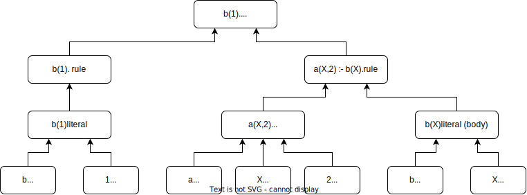

.. _prototype-description-reference:

Prototype Description
=======================

Used Tools and Libraries
--------------------------

The two most note-worthy libraries (pip-packages) that the prototype uses are:

1. **clingo**: From the popular python-clingo library, we primarily used the AST_ (Abstract Syntax Tree) features,
which enable us to efficiently parse a logic program.

2. **networkx**: Which we primarily used to find dependency graphs, one for handling SCCs in non-tight ASP,
and one for speeding up the (un)foundeness check of the reduction.

Additionally, for our experiments and regression tests we used the grounders and solvers of **clingo** and **IDLV**.

Abstract Description of the Prototype
-----------------------------------------

Generally speaking, the prototype has three main parts, where each part corresponds roughly to a **transformer** from the **clingo** AST_ library.
Such a **transformer** traverses the AST and enables us to edit the program, and retrieve necessary information, needed for grounding the program with Newground.
So the three main parts are:

1. Domain Inference
    - Consists of two transformers. 
    - First transformer (:ref:`newground-term-transformer-reference`): Gets the domain of all facts, and additionally creates datastructures needed for analyzing the SCCs for non-tight ASP.
    - Second transformer (:ref:`domain-transformer-reference`): Given a domain, a single call computes the next step of the domain (i.e., passing domain to head for each rule). Is called until a fixed point is reached.
2. Aggregate Rewriting
    - Rewrites aggregates according to the methods specified in the relevant literature.
    - Consists of one transformer (:ref:`newground-aggregate-transformer-reference`)
3. Applying the Reduction
    - Grounds a given program wrt to the domain and/or aggregate rewritings.
    - Consists of one transformer (:ref:`newground-main-transformer`)

Transformer 101
^^^^^^^^^^^^^^^^^

A "Transformer" is a class of Clingo’s submodule “ast” (Abstract Syntax Tree).
Therefore, the clingo submodule AST defines the syntax and grammar, which define valid ASTs.
Such an AST, is a tree G=(V,E), where V is a set of AST objects (e.g., a rule, or a term), and an edge exists, whenever there is a child-parent relationship.
To see a rough sketch of such an AST, see the image below, which shows the AST approximation of the program ``b(1). a(X,2) :- b(X).``.
Note that the this is **not the full AST**, but just a rough sketch how the AST looks like.

Besides the AST definition, the submodule features utility functions and classes, where the **Transformer** class is one such class.
An instantiated transformer performs a tree traversal of the AST, where each node can be changed.
Technically, when one implements a transformer, one inherits from the transformer class.
This has the benefit that all nodes which are not explicitly handled, are handled automatically in the standard way.
If one wants to handle a node type explicitly, one can do this by the "visit" methods.
These methods combine the prefix ``visit`` with an AST type (e.g. rule).
Therefore, the behavior of e.g. a rule can be changed by the method ``visit_rule``.
The parameter is the AST-object (node), and the return object is the (possibly) changed AST-Object (node).

The following code snippets give an example how the transformer class works, for a given program ``p(X) :- a(X), 1 <= #count{Z:a(Z)}. a(1).``.
The first code-snippet implements the transformer, which prints information about the aggregate:

.. code-block:: python

    from clingo.ast import Transformer

    class MyTransformer(Transformer):
        def visit_BodyAggregate(self, node):
            self.visit_children(node)

            print(node.function)
            print(node.left_guard)
            print(node.right_guard)
            print(node.elements)

            return node 

And the second one calls the transformer:

.. code-block:: python

    from clingo.ast import parse_string

    if __name__ == "__main__":
        program_string = "p(X) :- a(X), 1 <= #count{Z:a(Z)}. a(1)."
        my_transformer = MyTransformer()
        parse_string(program_string, lambda stm: my_transformer(stm))

Combining the code snippets into one file, and executing it via python, one gets the output:

.. code-block:: 

    0
    <= 1
    None
    [ast.BodyAggregateElement([ast.Variable(Location(begin=Position(filename='<string>', line=1, column=27), end=Position(filename='<string>', line=1, column=28)), 'Z')], [ast.Literal(Location(begin=Position(filename='<string>', line=1, column=29), end=Position(filename='<string>', line=1, column=33)), 0, ast.SymbolicAtom(ast.Function(Location(begin=Position(filename='<string>', line=1, column=29), end=Position(filename='<string>', line=1, column=33)), 'a', [ast.Variable(Location(begin=Position(filename='<string>', line=1, column=31), end=Position(filename='<string>', line=1, column=32)), 'Z')], 0)))])]

Where 0 indicates the ``#count`` aggregate, ``<= 1`` the left aggregate relation,
``None`` the right aggregate relation, and the list corresponds to the aggregate-element ``Z:a(Z)``.

Domain Inference
^^^^^^^^^^^^^^^^^^

As shortly described above, the domain inference works by first calling the Term-Transformer, and then repeatedly calling the Domain-Transformer, until a fixed-point is reached.
In more detail the Term-Transformer generates a variety of data-structures,
which lay the groundwork for other transformers.

The most significant data-structure is the ``domain`` dictionary, which contains the domain. 
Every item of the ``domain`` dictionary, is a key-value pair, where the key is a string and the value is either a list, or a dict.
In general there are three types of keys:

1. ``0_terms``: Where the corresponding value defines the whole domain.

2. A predicate ``p``: Then the value is a dict, which corresponds to the position in the arity of the predicate.
E.e., for a predicate ``p(X,Y)``, the value of ``domain["p"]`` is a dict,
where e.g. ``domain["p"][0]`` specifies the domain of the first position in the predicate.

3. A rule-variable combination ``term_rule_<RULE>_variable_<VARIABLE>``: The corresponding value is a single-element dict, which defines defines the domain of a specific variable in a specific rule. 

The second-most siginificant data-structure is the ``dependency_graph`` (and all related DS), which is a networkx-DiGraph.
It is ordered in such a way that there is a directed edge (``(p,q)``) between a predicate ``p`` and ``q`` iff there is a rule, 
where ``p`` occurs in the positive body and ``q`` in the head of the rule.
The related data-structures help associate the graph back to the original rules, which is needed in a later step.

Aggregate Rewriting
^^^^^^^^^^^^^^^^^^^^^^

The aggregate-transformer checks whether an aggregate occurs in a rule.
If so, then the selected aggregate rewriting technique is used, for each aggregate in the rule.
The individual strategies can be found in the package ``newground.aggregate_strategies``.

Main Transformer (Applying the Reduction)
^^^^^^^^^^^^^^^^^^^^^^^^^^^^^^^^^^^^^^^^^^^^

The main-transformer is the heart of the prototype.
In total it operates on a per-rule basis, i.e., for each ``visit_Rule`` it is decided,
whether the rule shall be rewritten, partly rewritten, or printed as it is.
Additionally, the handling of a ground and non-ground rule can be distinguished, 
where the non-ground rule is the standard case.
Then the reduction consists of the three main parts, as specified in the publications:

1. SAT check (:ref:`newground-main-transformer-helpers-generate-satisfiability-reference`)

2. Guessing the head (:ref:`newground-main-transformer-helper-guess-head-part-reference`)

3. (Un)foundedness (:ref:`newground-main-transformer-helpers-generate-foundedness-part-reference`)

Additionally, one has to note that the global-rewritings for the reduction (e.g. ``:- not sat.``) are largely done in the ``MainTransformer`` class,
with the exception of the *Level-Mappings*, which are processed in :ref:`newground-main-transformer-helpers-level-mappings-part-reference`.

.. _AST: https://potassco.org/clingo/python-api/current/clingo/ast.html
